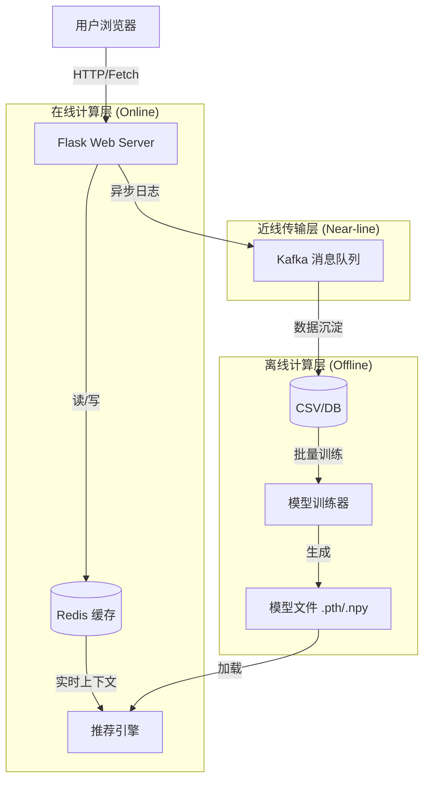

# Spotify 智能音乐推荐系统 - 项目设计手册

**版本**：1.0  
**日期**：2025年12月13日

---

## 1. 项目概述 (Project Overview)

### 1.1 项目背景
随着数字音乐平台的曲库规模爆炸式增长，用户面临“选择困难症”。本项目旨在构建一个基于深度学习的智能音乐推荐系统，通过分析歌曲的音频特征（Audio Features）和用户的实时行为，为用户提供个性化的音乐发现体验。

### 1.2 核心功能
1.  **歌单级推荐 (Playlist Continuation)**：基于用户输入的歌单风格，推荐风格相似的歌曲。
2.  **会话级推荐 (Session-based Recs)**：根据用户当前的点击、切歌行为，实时调整推荐列表。
3.  **音乐可视化**：展示歌曲的详细音频特征（如能量、舞曲度、情绪值）。
4.  **离线/在线双模式**：支持基于离线 CSV 数据的浏览，也支持基于 Spotify API 的在线数据获取。

---

## 2. 系统架构设计 (System Architecture)

本项目采用 **B/S (Browser/Server)** 架构，后端引入了 **“在线/近线/离线”** 三层分层设计，以平衡实时性与计算深度。

### 2.1 技术栈 (Tech Stack)
*   **前端**：HTML5, CSS3, JavaScript (Fetch API), Jinja2 模板引擎
*   **后端**：Python Flask (Web 框架)
*   **算法核心**：PyTorch (Autoencoder 神经网络), Scikit-learn (数据预处理), Pandas
*   **中间件/基础设施**：
    *   **Redis**：实时特征存储 (Online Feature Store)，用于会话级推荐。
    *   **Kafka**：异步消息队列 (Message Queue)，用于行为日志上报。
*   **数据源**：Spotify Web API + Kaggle Million Song Dataset (CSV)

### 2.2 架构图解



---

## 3. 核心模块详细设计 (Module Design)

### 3.1 推荐算法模块 (`recommender.py`)
本系统摒弃了传统的协同过滤（依赖用户ID），采用了**基于内容的深度学习推荐（Content-Based Deep Learning）**。

*   **模型架构**：多层感知机自动编码器 (MLP Autoencoder)。
    *   **输入层**：13 维音频特征（Danceability, Energy, Valence, Tempo 等）。
    *   **编码器 (Encoder)**：13 -> 128 -> 64 -> 32 (Latent Vector)。
    *   **解码器 (Decoder)**：32 -> 64 -> 128 -> 13。
*   **核心逻辑**：
    1.  **特征压缩**：利用 Encoder 将高维特征压缩为 32 维的 Embedding 向量，捕捉歌曲的潜在风格。
    2.  **最大相似度搜索 (Max Similarity)**：计算候选歌曲与用户历史歌曲的余弦相似度，取最大值作为推荐得分，以保留歌单的多样性。
*   **冷启动优化**：系统启动时自动加载 `model_cache/` 下的 `.pth` 和 `.npy` 文件，实现秒级启动。

### 3.2 应用服务模块 (`app.py`)
作为系统的控制中枢，负责处理 HTTP 请求和业务编排。

*   **路由设计**：
    *   `/`：首页。
    *   `/songs`：歌曲列表页（支持分页、搜索、筛选）。
    *   `/songs/<id>`：歌曲详情页（触发行为上报）。
    *   `/api/songs_recommendations`：**核心接口**，返回 JSON 格式的推荐结果。
    *   `/events`：前端埋点上报接口。
*   **会话管理**：使用 Flask Session 存储 `recent_track_ids`，维护用户的短期兴趣窗口（最近 20 首）。

### 3.3 基础设施模块 (`infra.py`)
封装了底层中间件的连接逻辑，实现了**容错降级**。

*   **`EventProducer` (Kafka)**：
    *   负责将 `track_view`, `skip`, `like` 等事件发送到 Kafka Topic。
    *   设计了 `try-except` 块，若 Kafka 未连接，自动降级为空操作，不影响主流程。
*   **`RedisFeatureStore` (Redis)**：
    *   负责存储用户的实时行为链（List 结构）。
    *   设置了 TTL (Time To Live) 为 1 小时，自动清理过期数据，节省内存。

---

## 4. 数据模型设计 (Data Model)

### 4.1 歌曲特征数据 (CSV Schema)
数据来源：`data/dataset.csv`

| 字段名 | 类型 | 说明 | 示例 |
| :--- | :--- | :--- | :--- |
| `id` | String | Spotify Track ID (主键) | `0VjIjW4GlUZAMYd2vXMi3b` |
| `track_name` | String | 歌曲名称 | `Blinding Lights` |
| `artist_name` | String | 歌手名称 | `The Weeknd` |
| `danceability` | Float | 舞曲度 (0.0-1.0) | `0.514` |
| `energy` | Float | 能量值 (0.0-1.0) | `0.730` |
| `valence` | Float | 情绪值 (0.0-1.0) | `0.334` |
| `tempo` | Float | 节奏 (BPM) | `171.005` |
| `popularity` | Int | 流行度 (0-100) | `95` |

### 4.2 用户行为数据 (Event Log)
存储于 Kafka 和 Redis 中。

```json
{
  "type": "track_view_offline",
  "track_id": "0VjIjW4GlUZAMYd2vXMi3b",
  "ts": 1702456789,
  "source": "songs_list",
  "client_id": "550e8400-e29b-41d4-a716-446655440000"
}
```

---

## 5. 接口设计 (API Specification)

### 5.1 获取实时推荐
*   **Endpoint**: `GET /api/songs_recommendations`
*   **描述**: 根据用户 Session 中的最近浏览记录，返回推荐歌曲。
*   **响应示例**:
    ```json
    [
      {
        "id": "...",
        "name": "Starboy",
        "artist": "The Weeknd",
        "genre": "Pop",
        "popularity": 90
      },
      ...
    ]
    ```

### 5.2 上报用户行为
*   **Endpoint**: `POST /events`
*   **描述**: 前端通过 Fetch API 异步上报用户交互。
*   **请求体**:
    ```json
    {
      "type": "skip",
      "track_id": "...",
      "position": 30
    }
    ```

---

## 6. 部署与运行 (Deployment)

### 6.1 环境要求
*   Python 3.8+
*   Redis (可选，推荐安装)
*   Kafka (可选，推荐安装)

### 6.2 目录结构说明
```text
spotify_rec_system/
├── app.py                 # 启动入口
├── recommender.py         # 推荐算法核心
├── infra.py               # 基础设施封装
├── dataset_service.py     # 数据读取服务
├── data/                  # 存放 dataset.csv
├── model_cache/           # 存放训练好的模型 (.pth, .npy)
└── templates/             # 前端页面
```

### 6.3 启动步骤
1.  安装依赖：`pip install -r requirements.txt`
2.  配置环境变量 (可选)：在 `.env` 中配置 `REDIS_URL` 和 `KAFKA_BOOTSTRAP_SERVERS`。
3.  运行服务：`python app.py`
4.  访问：打开浏览器访问 `http://127.0.0.1:5000`

---

## 7. 总结与展望
本项目成功构建了一个具备**实时响应能力**的音乐推荐系统。通过引入 **Autoencoder** 深度学习模型，解决了传统协同过滤在冷启动和长尾歌曲上的劣势；通过引入 **Redis 和 Kafka**，实现了工业级的高并发架构雏形。未来可进一步引入 Spark Streaming 进行实时流计算，以支持更复杂的推荐策略。
