# 🎵 Spotify Intelligent Recommendation System

[](https://www.python.org/)
[](https://flask.palletsprojects.com/)
[](https://pytorch.org/)
[](https://redis.io/)
[](https://kafka.apache.org/)
[](LICENSE)

一个基于深度学习（Autoencoder）和 Flask 构建的智能音乐推荐系统。该项目模拟了 Spotify 的推荐逻辑，支持基于音频特征的内容推荐、歌单续播以及实时用户行为分析。

---

## ✨ 核心功能 (Features)

### 1. 🎧 深度学习推荐 (Deep Learning Recs)
- **核心算法**：使用 **MLP Autoencoder** 将高维音频特征压缩为 32 维 Latent Vector。
- **内容匹配**：通过计算向量余弦相似度，精准推荐风格相似的歌曲（如“高能量+低情绪”的电子乐）。
- **冷启动优化**：支持模型权重与 Embedding 向量的离线缓存，实现秒级服务启动。

### 2. ⚡ 实时会话推荐 (Session-based Recs)
- **动态感知**：系统实时捕捉用户的点击、切歌、收藏行为。
- **短期兴趣**：基于用户最近 20 次交互构建短期兴趣窗口，实时调整推荐列表。
- **近线架构 (可选)**：支持利用 **Kafka** 异步上报行为日志，**Redis** 存储实时特征。
  > **注**：系统内置自动降级机制。若未配置 Redis/Kafka，系统将自动切换为纯内存模式运行，不影响核心推荐功能。

### 3. 📊 音乐可视化 (Music Visualization)
- **雷达图**：直观展示歌曲的 6 大核心音频特征（Energy, Danceability, Valence, Acousticness, Speechiness, Liveness）。
- **数据洞察**：帮助用户理解为什么这首歌会被推荐。

### 4. 🔄 双模式支持 (Dual Mode)
- **离线模式 (Offline)**：内置 Kaggle 百万歌曲数据集 (CSV)，无需联网即可演示核心算法。
- **在线模式 (Online)**：集成 Spotify Web API，支持获取真实专辑封面、试听片段（需配置 API Key）。

---

## 🧠 算法原理 (Algorithm)

本系统摒弃了传统的协同过滤（依赖用户ID），采用了**基于内容的深度学习推荐**，有效解决了长尾歌曲推荐难的问题。

### 模型架构：MLP Autoencoder

```mermaid
graph LR
    Input["输入层 (13维特征)"] -->|压缩| Enc1["Hidden (128)"]
    Enc1 --> Enc2["Hidden (64)"]
    Enc2 --> Latent["Latent Vector (32维)"]
    Latent -->|重构| Dec1["Hidden (64)"]
    Dec1 --> Dec2["Hidden (128)"]
    Dec2 --> Output["输出层 (13维)"]
```


- **输入特征**：Danceability, Energy, Valence, Tempo, Loudness, Key, Mode 等 13 维特征。
- **训练目标**：最小化重构误差 (MSE Loss)，迫使中间层 (Latent Vector) 学习到歌曲的本质风格。
- **推荐逻辑**：
  1.  将用户历史歌曲映射为向量 $V_{user}$。
  2.  将候选歌曲映射为向量 $V_{item}$。
  3.  计算 $Similarity = \cos(V_{user}, V_{item})$，取 Top-N 推荐。

---

## 🏗️ 系统架构 (Architecture)

采用 **B/S 架构**，后端引入了“在线/近线/离线”三层设计：

| 层级 | 组件 | 职责 |
| :--- | :--- | :--- |
| **在线层 (Online)** | Flask, Redis | 处理 HTTP 请求，读取 Redis 实时特征，执行向量检索，返回推荐结果。 |
| **近线层 (Near-line)** | Kafka | 异步接收前端埋点日志 (`track_view`, `skip`)，解耦高并发写入。 |
| **离线层 (Offline)** | PyTorch, Pandas | 批量清洗 CSV 数据，训练 Autoencoder 模型，生成并缓存 Embedding 索引。 |

---

## 🚀 快速开始 (Quick Start)

### 1. 环境准备
确保已安装 Python 3.8+。建议使用虚拟环境：

```bash
# 克隆仓库
git clone https://github.com/Aeolianbell319/Music-recommendation-system.git
cd Music-recommendation-system

# 创建虚拟环境
python -m venv venv
# Windows 激活
.\venv\Scripts\activate
# Mac/Linux 激活
source venv/bin/activate

# 安装依赖
pip install -r spotify_rec_system/requirements.txt
```

### 2. 配置环境变量
复制示例配置文件：
```bash
cp .env.example .env
```
编辑 `.env` 文件（本地演示模式下，Kafka 和 Redis 配置可留空，系统会自动降级）：
```ini
# 必填 (如果你想使用在线模式)
SPOTIPY_CLIENT_ID=your_spotify_client_id
SPOTIPY_CLIENT_SECRET=your_spotify_client_secret

# 选填 (Flask Session 密钥)
FLASK_SECRET=random_secret_key

# 选填 (中间件配置 - 不填则自动降级)
# REDIS_URL=redis://...
# KAFKA_BOOTSTRAP_SERVERS=...
```

### 3. 运行应用
```bash
cd spotify_rec_system
python app.py
```
启动后访问：`http://127.0.0.1:5000`

---

## 📂 项目结构 (Project Structure)

```text
Spotify-Recommendation-System/
├── spotify_rec_system/
│   ├── app.py                 # Flask 应用入口 (Controller)
│   ├── recommender.py         # 推荐算法核心 (Model & Inference)
│   ├── infra.py               # 基础设施连接 (Redis/Kafka Client)
│   ├── dataset_service.py     # 数据加载与预处理服务
│   ├── data/                  # 数据集目录 (CSV)
│   ├── model_cache/           # 模型权重 (.pth) 与向量索引 (.npy)
│   └── templates/             # 前端页面 (Jinja2 HTML)
├── Project_Design_Manual.md   # 详细设计文档
├── requirements.txt           # 项目依赖列表
└── README.md                  # 项目说明文档
```

## 📝 API 文档 (API Docs)

### 获取推荐
- **URL**: `/api/songs_recommendations`
- **Method**: `GET`
- **Response**:
  ```json
  [
    {
      "id": "0VjIjW4GlUZAMYd2vXMi3b",
      "name": "Blinding Lights",
      "artist": "The Weeknd",
      "similarity": 0.98
    },
    ...
  ]
  ```

### 上报行为
- **URL**: `/events`
- **Method**: `POST`
- **Body**: `{"type": "track_view", "track_id": "..."}`

---

## 🤝 贡献 (Contributing)
欢迎提交 Issue 或 Pull Request！

## 📄 许可证 (License)
本项目采用 [MIT License](LICENSE) 许可证。

---
*注意：本项目仅供学习与研究使用，音频数据版权归 Spotify 及相关版权方所有。*
